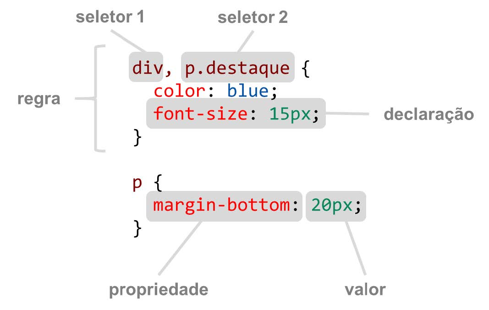
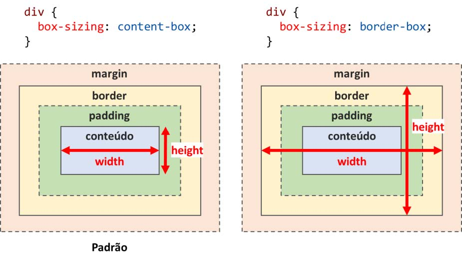
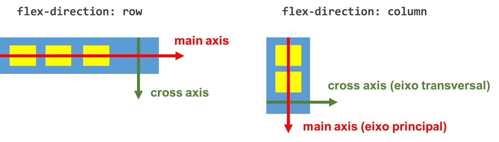

# CSS

Cascading Style Sheets, ou apenas **CSS**, é uma linguagem para definir estilização de documentos HTML. Enquanto o HTML lida com estrutura e conteúdo, CSS lida com cores, posicionamento, estilos de fonte, e qualquer outro aspecto visual da página.

###  Introdução a CSS e sintaxe básica

**Incluindo CSS no documento**

O CSS pode ser incluído no documento HTML de duas formas, como arquivo externo por meio do elemento link:

```html
<link rel="stylesheet" href="styles.css">
```

ou como estilos inline na página:

```html
<style>
     div {
     color: blue;
     }
</style>
```

Por fim, podemos definir estilos diretamente em Sintaxe Básica.

<br>

**Sintaxe básica**

A sintaxe básica do CSS segue o seguinte padrão:

 

Regras CSS são compostas por seletores, que especificam para quais elementos elas se aplicam, e um bloco de declarações de propriedades e valores.

#### Propriedades CSS

Propriedades CSS podem ser herdadas de elementos pai para seus filhos, ou não. Por exemplo, ao definir a cor da fonte (color) em `body`, os elementos filhos herdam a mesma cor. Por outro lado a largura de um elemento (propriedade width) não é herdada.

| Propriedades herdadas                                        | Propriedades não herdadas                                    |
| ------------------------------------------------------------ | ------------------------------------------------------------ |
| `color`<br/>`font`<br/>`size`<br/>`font`<br/>`family`<br/>... | `margin`<br/>`width`<br/>`height`<br/>`border`<br/>`background`<br/>`color`<br/>... |

#### [Seletores CSS](https://www.w3schools.com/css/css_selectors.asp)

Os seletores CSS são usados para "encontrar" (ou selecionar) os elementos HTML que você deseja estilizar.

Podemos dividir os seletores CSS em cinco categorias:

- Seletores simples (selecionar elementos com base no nome, id, classe);
- [Seletores de combinação](https://www.w3schools.com/css/css_combinators.asp) (selecionam elementos com base em uma relação específica entre eles);
- [Seletores de pseudoclasse](https://www.w3schools.com/css/css_pseudo_classes.asp) (selecionar elementos com base em um determinado estado);
- [Seletores de pseudoelementos](https://www.w3schools.com/css/css_pseudo_elements.asp) (selecionar e estilizar uma parte de um elemento);
- [Seletores de atributo](https://www.w3schools.com/css/css_attribute_selectors.asp) (selecionar elementos com base em um atributo ou valor de atributo);

Podemos usar diferentes tipos de seletores e combinadores em CSS. Abaixo temos uma tabela com os tipos mais comuns.

| SELETOR                                   | EXEMPLO              | DESCRIÇÃO                                                    |
| ----------------------------------------- | -------------------- | ------------------------------------------------------------ |
| Seletor de elemento                       | `p`                  | Seleciona os elementos HTML com base no nome do elemento. <br> No exemplo, seleciona todos os elementos `<p>` da página. |
| Seletor universal (`*`)                   | *                    | Seleciona todos os elementos da página.                      |
| Seletor de classe (`.`)                   | `.exemplo-classe`    | Seleciona elementos HTML com um atributo de classe específico. <br>No exemplo, seleciona o elemento que possui o atributo class="exemplo-classe" |
| Seletor de id (`#`)                       | `#exemplo-id`        | Seleciona um elemento específico conforme o atributo id de um elemento HTML. O seletor de `id` é usado para selecionar um elemento único na pagina. <br> No exemplo, seleciona o elemento que possui o atributo id="exemplo-id" |
| Seletor  Descendente (espaço)             | `div` `p`            | Seleciona todos os elementos que são descendentes de um elemento especificado. <br/>No exemplo, seleciona todos os elementos `<p>` dentro do elemento `<div>`. |
| Seletor filho (`>`)                       | `div` > `p`          | Seleciona todos os elementos que são filhos de um elemento especificado. <br/>No exemplo, seleciona todos os elementos `<p>` que são filhos de `<div>`. |
| Seletor geral de irmãos (`~`)             | `div` ~ `p`          | Seleciona todos os elementos que são irmãos próximos de um elemento especificado. <br>No exemplo, seleciona todos os elemento `<p>` que são irmãos próximos do elemento `<div>`. |
| Seletor de irmão adjacente (`+`)          | `div` + `p`          | Seleciona todos os elementos que está diretamente após outro elemento específico. Os elementos irmãos devem ter o mesmo elemento pai e "adjacente" significa "imediatamente seguinte". <br>No exemplo, seleciona o primeiro elemento `<p>` que é colocado imediatamente após os elementos `<div>`. |
| Seletor de atributo `[attribute="value"]` | `a[target="_blank"]` | Seleciona elementos com um atributo e valor especificados. <br> No exemplo, seleciona todos os elementos `<a>` com um atributo ` target="_blank"`. |

**[Pseudo-classes](https://www.w3schools.com/css/css_pseudo_classes.asp)**

Além de seletores acima especificados, temos também as **pseudoclasses**, que são usadas para definir uma características estruturais ou estado especial de um elemento.

Por exemplo, pode ser usado para:

- Estilizar um elemento quando um usuário passa o mouse sobre ele
- Estilizar links visitados e não visitados de forma diferente
- Estilizar um elemento quando ele recebe o foco

Abaixo temos algumas pseudo-classes

| SELETOR         | EXEMPLO          | DESCRIÇÃO                                                    |
| --------------- | ---------------- | ------------------------------------------------------------ |
| `:disabled`     | `input:disabled` | Seleciona cada elemento `<input>` desabilitado.              |
| `:hover`        | ` a:hover`       | Seleciona links ao passar o mouse                            |
| `:focus`        | `input:focus`    | Seleciona um elemento `<input>` que tem foco                 |
| `:first-child`  | `p:first-child`  | Seleciona um elemento `<p>` que é o primeiro filho de seu pai |
| `:last-child`   | ` p:last-child`  | Seleciona um elemento `<p>` que é o último filho de seu pai  |
| `:empty`        | `p:empty`        | Seleciona um elemento `<p>` que não tem filhos               |
| `:not(seletor)` | `:not(p)`        | Seleciona todos os elementos que não são um elemento `<p>`   |

Vale ressaltar que os diferentes tipos de seletores podem ser combinados em uma única expressão, por exemplo `a.destaque.grande:disabled` seleciona elementos A, com as classes destaque e grande, que está desabilitado.

---

### Dimensionamento e posicionamento de elementos

Elementos CSS são dimensionados seguindo o box model, que é representado pela figura a seguir.

 

O espaço ocupado por um elemento é composto por seu conteúdo, o `padding` (distância do conteúdo para a borda), espessura da borda e por fim de sua margem. No formato `box-sizing: content-box` (comportamento padrão), a largura (propriedade width) e altura (propriedade height) consideram apenas a região de conteúdo. Por outro lado, no formato `box-sizing: border-box`, width e height consideram até a extremidade externa da borda.

As propriedades `width`, `height`, `padding`, `margin`, e várias outras, podem ser especificadas com diferentes unidades de medidas. Alguns exemplos são dados na tabela a seguir.

| UNIDADES DE MEDIDAS | DESCRIÇÃO                                                    |
| ------------------- | ------------------------------------------------------------ |
| px                  | Um ponto da tela.                                            |
| cm, mm, in          | Centímetros, milímetros, polegadas, etc.<br/>(fazem mais sentido para impressão) |
| em                  | Tamanho da fonte corrente.                                   |
| rem                 | Tamanho da fonte do elemento raiz da página.                 |
| vh                  | 1% da altura do viewport.                                    |
| vw                  | 1% da largura do viewport.                                   |
| %                   | Relativo a outra medida (normalmente do elemento pai).       |

### [Overflow](https://www.w3schools.com/css/css_overflow.asp) 

A propriedade `overflow` especifica se deve cortar o conteúdo ou adicionar barras de rolagem quando o conteúdo de um elemento for muito grande para caber na área especificada

Ela possui os seguintes valores:

- `visible` (padrão): conteúdo pode ser renderizado fora do box. 
- `hidden`: o conteúdo é cortado.
- `scroll`: exibe scroll bar sempre.
- `auto`: exibe scroll bar, se precisar.

---

### [Posicionamento padrão (normal flow)]()

Por padrão, os elementos são dispostos na página em linha (ao lado do anterior), ou em blocos (abaixo do anterior), dependendo do tipo de elemento. Por exemplo, h1, div e p são block boxes, enquanto span, img e a são inline boxes.

Podemos controlar o alinhamento horizontal de elementos dentro de uma linha com a propriedade text-align, cujos valores podem ser (`left`, `right`, `center`, `justify`, etc.). Já o alinhamento vertical dos elementos dentro de uma linha é controlado pela propriedade `vertical-align`, cujos valores podem ser (`baseline`, `middle`, `top`, `bottom`, etc.).

---

### [Posicionamento fora do normal flow ](https://www.w3schools.com/css/css_positioning.asp)

Usando a propriedade `position` podemos alterar o normal flow. O valor padrão dessa propriedade é `static`, mas podemos alterá-la para:

- `relative`: é posicionado em relação à sua posição normal, mas podemos deslocar de sua posição normal via propriedades top, right, bottom e left.
- `absolute`: Posicionado fora do normal flow (não ocupa espaço). Posição definida via propriedades top, right, bottom e left, relativas ao primeiro elemento pai posicionado (position ≠ static).
- `fixed`: Posicionado fora do normal flow (não ocupa espaço). Posição definida via propriedades top, right, bottom e left, relativas ao viewport (não faz scroll).

---

### [Flexbox layout](https://css-tricks.com/snippets/css/a-guide-to-flexbox/)

O modelo de layout flexbox foi introduzido nas especificações mais recentes do CSS e oferece grande poder e versatilidade para posicionar elementos. Para ativá-lo, definimos a propriedade display como `flex` ou `inline-flex`:

- `flex`: comporta como block box externamente, e flexbox layout internamente;
- `inline-flex`: comporta como inline box externamente, e flexbox layout internamente.

A direção dos filhos de um contêiner `flexbox` é definida pela propriedade `flex-direction`, que pode ter valor `row` ou `column`. No caso de `row`, o eixo principal é horizontal, ou seja, os elementos são dispostos ao lado dos outros. No caso de `column`, o eixo principal é vertical e os elementos são dispostos abaixo um do outro.

 

Além disso, é possível controlar várias propriedades para determinar os alinhamentos dos filhos.

- Alinhamento no eixo principal (`justify-content`);
- Alinhamento no eixo transversal (`align-items`, `align-self`);
- Tamanho de cada item (`flex`, `flex-grow`, `flex-shrink`, `flex-basis`);
- Quebras de linha/colunas (`flex-wrap`).


